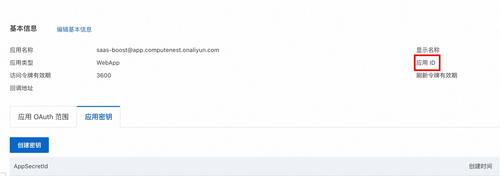
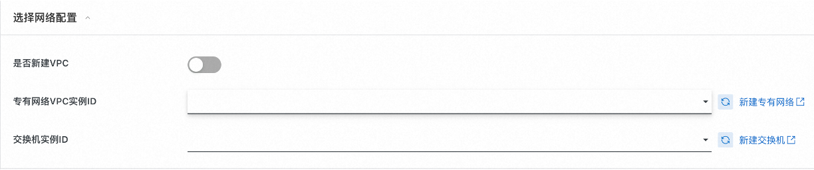
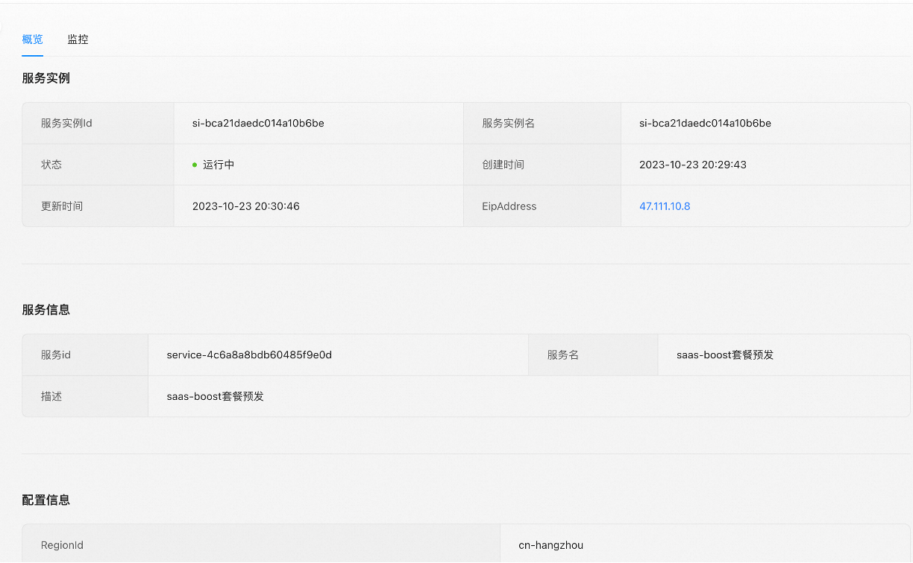

# 计算巢SaaS Boost快速部署

## 前提条件

使用阿里云计算巢SaaS Boost服务实例，需要对部分阿里云资源进行访问和创建操作。因此您的账号需要包含如下资源的权限。
**说明**：当您的账号是RAM账号时，才需要添加此权限。

| 权限策略名称                              | 备注                         |
|-------------------------------------|----------------------------|
| AliyunECSFullAccess                 | 管理云服务器服务（ECS）的权限           |
| AliyunVPCFullAccess                 | 管理专有网络（VPC）的权限             |
| AliyunROSFullAccess                 | 管理资源编排服务（ROS）的权限           |
| AliyunCloudMonitorFullAccess        | 管理云监控（CMS）的权限              |
| AliyunOSSFullAccess                 | 管理对象存储服务(OSS)的权限           |
| AliyunOOSFullAccess                 | 管理运维编排服务(OOS)的权限           |
| AliyunFCFullAccess                  | 管理函数计算(FC)服务的权限            |
| AliyunOTSFullAccess                 | 管理表格存储服务(OTS)的权限           |
| AliyunComputeNestSupplierFullAccess | 管理计算巢服务（ComputeNest）的商家侧权限 |

## 计费说明

计算巢SaaS Boost部署涉及的费用主要涉及：
- 云服务器服务（ECS）费用
- 表格存储（OTS）费用
- 函数计算（FC）费用
- 对象存储（OSS）费用
- 流量带宽费用

## 参数说明
| 参数组       | 参数项                     | 说明                                                                         |
|-----------|-------------------------|----------------------------------------------------------------------------|
| 服务实例      | 服务实例名称                  | 长度不超过64个字符，必须以英文字母开头，可包含数字、英文字母、短划线（-）和下划线（_）                              |
|           | 地域                      | 服务实例部署的地域                                                                  |
| 待部署的计算巢服务 | 计算巢服务Id                 | 待部署的用户企业的计算巢服务Id                                                           |
| OAuth配置   | OAuthClientId           | 阿里云OAuth认证Client Id                                                        |
|           | OAuthClientSecret       | 阿里云OAuth认证 Client Secret                                                   |
| 支付宝（沙箱）配置 | AlipayAppId             | 支付宝（沙箱）应用ID                                                                |
|           | AlipayPid               | 支付宝（沙箱）应用商家Id                                                              |
|           | AlipayPrivateKey        | 支付宝（沙箱）应用私钥                                                                |
|           | AlipayOfficialPublicKey | 支付宝官方应用公钥                                                                  |
| 流水线配置     | 企业                      | 选择/新建您的企业                                                                  |
|           | GitHub服务连接              | 连接到GitHub的凭证。可通过账号密码方式创建                                                   |
|           | GitRepoEndpoint         | 仓库地址                                                                       |
| 付费类型配置    | 付费类型                    | 按量付费/包年包月                                                                  |
| ECS实例配置   | 实例类型                    | 部署的ECS实例类型                                                                 |
|           | 实例密码                    | 服务器登录密码,长度8-30，必须包含三项（大写字母、小写字母、数字、 ()`~!@#$%^&*_-+=｜{}[]:;'<>,.?/ 中的特殊符号） |
| 可用区配置     | 交换机可用区                  | 该实例类型可部署的可用区                                                               |
| 网络配置      | 是否新建VPC                 | 选择是否在当前可用区新建VPC                                                            |
|           | 专有网络VPC实例Id             | 选择当前可用区下的VPC实例                                                             |
|           | 交换机实例Id                 | 选择当前VPC支持的交换机                                                              |

## 部署流程

部署计算巢SaaS Boost的流程如下：

### 步骤一 **Fork当前仓库**
Fork当前仓库到您的个人仓库

### 2. **创建支付宝沙箱账号**

指引图片中被红框框住的参数在创建服务实例中会被使用到。

1. 按照[支付宝沙箱文档](https://open.alipay.com/develop/sandbox/app)中的说明，创建支付宝沙箱账号。其中应用网关地址和授权回调地址待创建好服务实例后回填。
    
   
2. 保留支付宝沙箱应用的私钥和支付宝的官方公钥
 
   

### 3. **创建阿里云OAuth认证账号**：
1. 按照[阿里云OAuth文档](https://help.aliyun.com/zh/ram/user-guide/access-alibaba-cloud-apis-from-a-web-application?spm=a2c4g.11186623.0.0.166d390dvx9Gg4)中的说明，在"访问控制"控制台中创建阿里云OAuth应用。输入应用名称和显示名称，选择WebApp的应用类型，最后的回调地址待服务实例创建好后回填。
    

2. 给当前OAuth Client添加aliuid和profile的OAuth范围
    

3. 在应用密钥处点击"创建密钥"，并记录应用Id（clientId）和应用密钥（clientSecret）。注意是应用Id而不是AppSecretId。
    
   

### 4. **创建计算巢SaaS Boost一键部署服务实例**
1. 访问[计算巢控制台](https://computenest.console.aliyun.com/)选择SaaS Boost一键部署服务
2. 安装提示填写部署参数
    1. 选择要部署的服务。目前仅支持示例服务。
    2. 选择部署地域
    3. 填入OAuth认证信息
    
   
    4. 填入支付宝沙箱信息
        
       

    5. 在流水线配置中，创建您的企业。根据前文fork的仓库信息创建Git连接凭证，填入前文fork的仓库地址。
        
       
    6. 选择付费类型和想要部署的Ecs实例规格及部署可用区
        
       
    7. 选择/新建专有网络(VPC)和交换机(VSW)
        
       

3. 确认同意服务协议并点击**立即创建**
   进入部署阶段。
    
   

4. 服务实例创建好后回填参数
   1. 在部署的实例信息中将AlipayNotifyUrl和AlipayReturnUrl分别回填到支付宝沙箱应用配置中的应用网关地址和授权回调地址(步骤2.1)
       
      
   2. 将实例信息中的Endpoint回填到阿里云OAuth应用的回调地址中（步骤3.1）。

### 5. **访问计算巢SaaS Boost服务**
点击部署好的服务实例详情页的Endpoint即可访问示例SaaS Boost界面。
 

## 使用
一旦计算巢SaaS Boost部署完成，您就可以开始使用它来开发、部署和销售您的软件应用程序。以下是一些关键的使用说明：

1. **配置您的SaaS应用（计算巢Service）**：
    - 上传部署物或使用快速ROS模版搭建您服务的计算巢Service。见文档[快速开始]
    - 在application.properties文件中配置套餐
    - 重新运行流水线，完成SaaS应用的部署。

2. **支付宝沙箱测试**：在正式售卖前，请利用支付宝沙箱APP测试售卖能力。
    1. 在支付宝沙箱工具中下载支付宝客户端沙箱版安卓APP
        
       

    2. 选择想要创建的服务实例套餐
        
       
   3. 使用沙箱应用中提供的账号密码进行支付测试。
   4. 查看已部署的服务实例详情
       
      
   5. 查看已部署服务实例监控
       
      
   6. 查看历史订单
       
      

3. 在通过沙箱测试后，务必再次使用正式的支付宝账号进行售卖测试。

## 开发者指南
更多的一些信息，如对参数的修改和套餐的配置见文档 [developer-guide](./developer-guide.md)